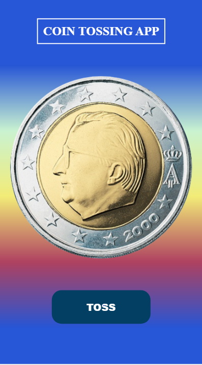
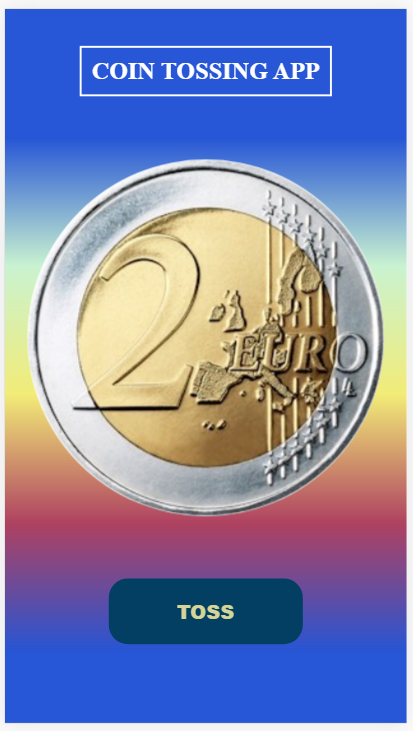

# **CoinToss**
#### CoinToss is a web application built in JavaScript. It randomly generates head or tail results by rotating a virtual coin back and forth in the user's device. This app was made for a local Cricket Club named Everest CC, which uses this app instead of tossing a real coin at the match's start. ####

#  **Technologies Used** #
### HTML, CSS(animation) and JavaScript ###

# **[Link to the WebApp](https://pragatibhandari.github.io/CoinToss/)** #

